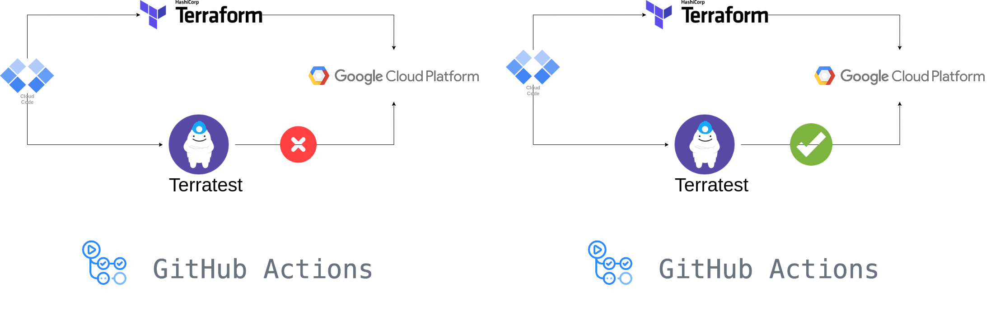

# Terraform Cloud Run Application Test

This repository contains code and instructions for testing a Cloud Run application deployed using Terraform. The tests are written using Terratest, a Go-based library for automated infrastructure testing. 

Terratest provides a high-level API for testing infrastructure, making it easier to write automated tests for Terraform code. The Cloud Run infrastructure is deployed using Terraform, a tool for building, changing, and versioning infrastructure.




[Diagram inspired from](https://www.google.com/url?sa=i&url=https%3A%2F%2Fdevopscounsel.com%2Fwriting-automated-tests-for-terraform-code-using-terratest%2F&psig=AOvVaw189TVLGOvJO6voRWchZbQ_&ust=1683637805028000&source=images&cd=vfe&ved=0CBMQjhxqFwoTCPCGzNzl5f4CFQAAAAAdAAAAABAK)

## Prerequisites
Before proceeding, ensure that you have the following installed on your system:

* Terraform v1.0.4
* Go v1.18.1 
* GCP account with billing enabled
* Google Cloud SDK installed
* A service account key for the GCP project with the `Cloud Run Admin`, `IAM Service Account Actor`, and `Service Account User` roles assigned


## Repository Structure

```
terraform-terrates-guide/
├── .github/
│   └── workflows/
│       └── ci.yml
├── cloud_run_module/
│   ├── main.tf
│   ├── outputs.tf
│   └── variables.tf
├── examples/
│   ├── main.tf
│   ├── outputs.tf
│   └── variables.tf
├── test/
│   ├── main_test.go
│   └── terratest.hcl
└── README.md
```

`.github/workflows/ci.yml`: This file defines the CI workflow on Github Actions that runs the Terratest scripts whenever a pull request is opened or pushed to the main branch. 

`cloud_run_module/main.tf`: This file defines the Cloud Run module.

`cloud_run_module/outputs.tf`: This file defines the output variables for the Cloud Run module.

`cloud_run_module/variables.tf`: This file defines the input variables for the Cloud Run module.

`examples/main.tf`: This file defines the input variables for the Cloud Run service.

`examples/outputs.tf`: This file defines the output variables for the Cloud Run service.

`examples/variables.tf`: This file defines the input variables for the Cloud Run service.

`test/main_test.go`: This file defines the test cases that are run by Terratest.

`test/terratest.hcl`: This file defines the Terraform module that is used by Terratest.

`README.md`: Instructions and information for using this repository.


## Getting Started

To run the tests, follow these steps:

1. Clone this repository to your local machine:

   ```sh
   git clone https://github.com/OmarMerghany/terraform-terratest-guide.git

2. Set the environment variables required for the tests:

    ```sh
    export GOOGLE_APPLICATION_CREDENTIALS=/path/to/service/account/key.json
    export GCP_PROJECT_ID=<your-gcp-project-id>.
    export REGION=<YOUR_REGION>
    export service_name=<YOUR_service_name>
    export image=<YOUR_IMAGE_NAME> #"gcr.io/google-samples/hello-app:1.0"

3. Navigate to the test directory and run `go mod init test` followed by `go mod tidy`

4. Navigate to the test directory and run `go test -v`